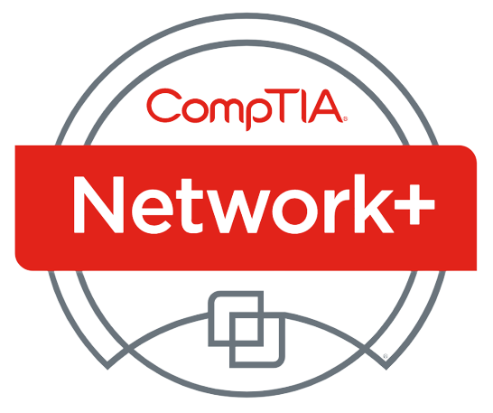

<!-- ===================================================== -->
<!-- 🔥 CUSTOM HEADER WITH ROLES + BADGES -->
<!-- ===================================================== -->

<h1 align="center">Hey, I'm Sultan 👋</h1>

  <b>Endpoint Security Engineer</b> • 
  <b>Cloud Security</b> • 
  <b>Detection Engineering</b> • 
  <b>Incident Response</b>

  <!-- LinkedIn -->
  
  
  <!-- GitHub -->
  

 

---

# 🧑‍💻 About Me

Hi! I'm **Sultan Taj**, currently working as an **Enterprise Security Engineer**

- Endpoint Security (CrowdStrike)
- Incident Response & Threat Detection
- Cloud Security (**AWS** / _Azure_)

---

<h2>🏅 Certifications</h2>

  
  
  
  
  
  

---

# 🛠️ Tech & Tooling  
### Security / IR / Detection

  
  
  
  
  
  

### Languages & Dev

  
  
  
  
  
  

---

# 🎯 What I'm Working On

- 🧨 **Pwned Labs + TryHackMe (ACRTP prep)**  
- ☁️ **AWS Security Specialty**  
- 🔍 Building more **detection engineering projects** + advanced cloud labs  

---

# 🚀 Featured Projects

### 🛰️ Threat Detection & Cloud Security  
🔗 **[AWS: Security Operations Center](https://github.com/STaj-55/AWS-SOC)**  
A full AWS SOC with detections, SIEM connectors, incident pipelines, and attacker technique emulation.

### 🧮 Incident Response Engineering  
🔗 **[Cybersecurity IR Database – MySQL](https://github.com/STaj-55/Cybersecurity_Incident_Response_Database)**  
A SQL-driven IR case management and IOC tracking system.

### 🤖 Machine Learning for Security  
🔗 **[SUNY Poly Capstone – ML Threat Detection](https://github.com/STaj-55/Capstone)**  
Real-time ML-based anomaly detection for security events.

### ⚙️ Infrastructure & Automation  
🔗 **[Ansible Security Workshop](https://github.com/STaj-55/Ansible-Workshop)**  
Hands-on lessons for infra automation aimed at security teams.

---

# 🧪 Additional Labs

- **[Real-Life Phishing Analysis](https://github.com/STaj-55/JobPhishing)**  
- **[LetsDefend SOC Labs](https://github.com/STaj-55/LetsDefend)**  
- **[Palo Alto XSOAR Labs](https://github.com/STaj-55/GCP_XSOAR_Labs)**  

---

# 🤝 Connect

💼 LinkedIn: **[linkedin.com/in/sultantaj](https://www.linkedin.com/in/sultantaj/)**  
🧑‍🚀 Open to collabs in **Cloud Security, IR, or Detection Engineering**.

---

<!-- ===================================================== -->
<!-- OPTIONAL EXTRAS BELOW — UNCOMMENT IF YOU WANT THEM -->
<!-- ===================================================== -->

<!--
## 📊 GitHub Stats

  
  

## 🔥 GitHub Streak

  

## 🏆 GitHub Trophies

  

-->

